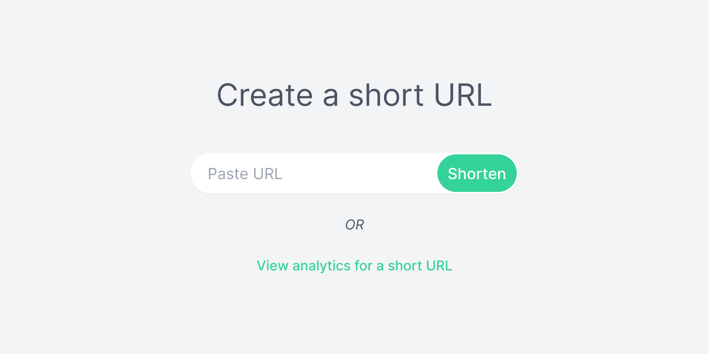

# Backend Projects - URL Shortener

## Welcome!

This is the first project in a collection of back-end projects for (aspiring) developers who want to practice their skills and have a beautiful portfolio without having to worry about design or front end.

## The project

Your goal is to build a back end that provides the functionality for a URL shortening service.

Closely follow the API documentation (more on that below) and implement the specified endpoints in the back end. When done correctly, the provided front-end app should work seamlessly with your back end.

You're free to choose any frameworks and libraries you want for this project. If you want to practice or learn something new, this is an excellent oportunity to do so.

### User stories

These user stories provide an overview of the features you need to implement. Use them to guide your back-end tests, and tick them off as you build your project. Refer back to them to check if you have implemented all the features.

- [ ] As a user, I want to submit an URL and receive a short URL in return
- [ ] As a user, when I navigate to the short URL I want to be redirected to the original URL
- [ ] As a user, navigating to the short URL should increase the visit count by 1
- [ ] As a user, I want to submit a short URL and see how many times it has been visited
- [ ] As a user, when I navigate to a non-existing short URL I should see a page informing the URL doesn't exist

### Bonus tasks

If you like an extra challenge and want to take your skills to the next level, implement the following bonus tasks.

- Short URLs should not be easy to guess
- Submitting the same URL more than once should return its corresponding short URL instead of creating a new short URL
- Check if a URL is already a short URL to avoid shortening a short URL
- Check if the URL leads to a valid page before shortening it
- Make it harder to shorten URLs that lead to known malicious sites (short URLs are often used by scammers)

### Notes

A good short URL is short, unique, and consists of alphanumeric characters only.

### Resources

These resources may help you build your project. Some of them are tutorials which should serve as inspiration rather than be used to copy-paste code.

- https://jerrynsh.com/i-built-my-own-tiny-url/
- https://stackoverflow.com/questions/73342620/how-can-url-shorteners-service-provider-be-more-secure
- https://zelark.github.io/nano-id-cc/

## What's inside

### Front-end application

The front-end application lives inside the `./frontend` folder. To start the app, run `npm run frontend` from the project root directory `./` and go to `http://localhost:3000` in your browser.

By default, the app will run on port 3000. If you wish to use a different port, change the `PORT=` value inside `./package.json`.

The app will try to reach the back end at `http://localhost:8000`. You can configure this by changing the `API_URL` variable inside the `./frontend/.env` file.

### API documentation

This project comes with a `openapi.yaml` file to help you implement the back end. Upload the file to [ReDoc](https://redocly.github.io/redoc/) to render a user-friendly API documentation.

You can also import the file into API clients like [Insomnia](https://insomnia.rest/) or [Hoppscotch](https://hoppscotch.io/)) to import the project API. Using an API client is a quick way to test your back end during development without needing to start the front-end application.

> Please don't upload the API documentation to a public repository, or distribute it in any other way. Thank you! 🙂

## Building your project

Here's a suggested workflow. Feel free adapt it to your liking or use your own.

1. Initialize this project as a public [Github](https://github.com/) repository. Having a public link to your project will make it easier to share your solution and have something to refer to when talking with potential employers.
2. Browse the API documentation to get an overview of the endpoints you'll need to implement. The response bodies should give you an idea of the application data you'll work with.
3. Write a basic server that exposes the endpoints from the API documentation. Pay attention to HTTP methods, status codes and Content-Type. Return hardcoded mock data for now. This step ensures you have a server running and the data is parsed correctly and flowing smoothly between client and server.
4. Add client data validation to endpoints that expect a request body. It's good practice to always add at least a few basic checks for the data sent by the client.
5. Connect your back end to a database and write your models. Write the queries for each endpoint and replace mock data with query results. You're free to choose any database technology as long as the response bodies match the API doc.
6. Implement the business logic for each endpoint. Extract common functionality between endpoints into helper functions.

## Deploying your project

How you deploy your back end will largely depend on whether you want to host it on a rented cloud server (VPS) or a managed server (PaaS).

### VPS

Hosting your project on a VPS is a great way to learn what it takes to deploy an application (the DevOps/SysAdmin side of the back end). You'll get more familiar with Linux and become proeficient at using the command-line. Employers value back-end developers that can work with cloud technologies and know how to deploy applications to production.

[AWS](https://aws.amazon.com/free/) and [Google Cloud](https://cloud.google.com/free) are the most popular cloud infrastructure providers on the market. They both offer free tiers. I've also heard good things about [Oracle Cloud](https://www.oracle.com/cloud/free/) recently.

Although not free, DigitalOcean has an intuitive UI and is much easier to use than the above options. They also have a [massive collection of tutorials](https://www.digitalocean.com/community/tutorials) on how to deploy about anything. You can use my [referral link](https://m.do.co/c/769e34824ce5) to get $200 in credits.

### Platform-as-a-Service (PaaS)

The benefits of a PaaS is not having to manage a server or worrying about your server being hacked. It's usually easier to deploy your application, especially if you're not familiar with Linux and the command-line.

[Render](https://render.com/) and [Fly.io](https://fly.io/) are two popular PaaS providers offering free tiers. [Heroku](https://www.heroku.com/) is also a very popular choice but they discontinued the free tier and now it's paid only.

### Managed DB Hosting

You can also choose to host your database separately from your back end. Here are some managed DB hosting services with free tiers available:

- PostgreSQL - [ElephantSQL](https://www.elephantsql.com/), [Neon](https://neon.tech/)
- MongoDB - [MongoDB Atlas](https://www.mongodb.com/atlas/database)
- Redis - [Redis.com](https://redis.com/redis-enterprise-cloud/overview/) (formerly RedisLabs)

## Sharing your project

Writing about how you built the project and the decisions you've made, not only reinforces what you've learned, it also gives prospective employers an insight in your thought process and your problem-solving skills. [Dev.to](https://dev.to/) and [Hasnode](https://hashnode.com/) are great platforms for that.

Share your solution on social media channels such as LinkedIn, Reddit and Facebook. If you're on Twitter, share a link to your project and don't forget to mention me [@_maximization](https://twitter.com/_maximization). I'd love to see what you've built and help spread the word.

## Got feedback?

I'd love to get feedback from you! If you have anything you'd like to share, please email me at [hello@maximorlov.com](mailto:hello@maximorlov.com?subject=Feedback%20for%20Backend%20Projects%20-%20URL%20Shortener). Your feedback will help improve these back-end projects and provide a better experience for others.

## Have fun building! ⚒️ 🚀